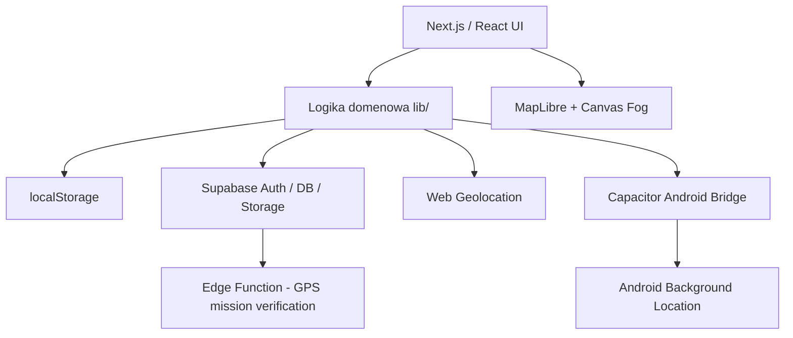
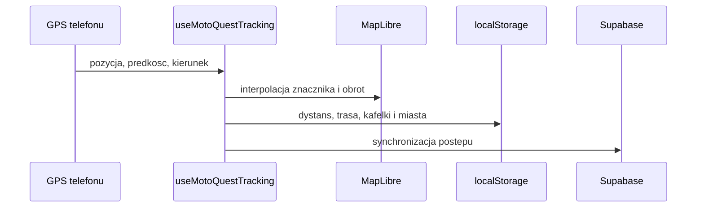
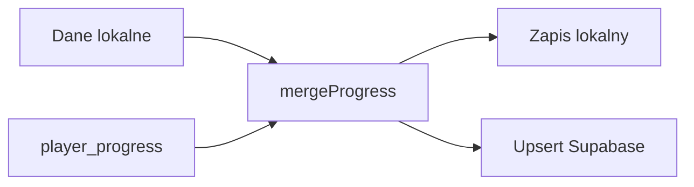

# Architektura MotoQuest

## Warstwy

## Przeplyw GPS

## Mapa i Fog of Discovery

`MapView.tsx` utrzymuje MapLibre, a `MapHud.tsx` obsluguje warstwy i przyciski. Mgla jest rysowana na Canvas. Odkryte kafelki sa projektowane na ekran i wycinane operacja `destination-out`. Renderer adaptuje DPR i czestotliwosc animacji do urzadzenia.

## Synchronizacja gracza

Tablice sa laczone po identyfikatorze, dystans wybiera maksimum, a XP jest ponownie przeliczane. Garaz laczy motocykle po `bike.id`.

## Misje miejskie

1. Aplikacja pobiera miasto i przypisane misje.
2. Telefon pobiera dokladna pozycje GPS.
3. Zdjecie wymaganej misji trafia do prywatnego Storage.
4. Edge Function sprawdza uzytkownika, odleglosc i sciezke pliku.
5. Supabase zapisuje zaliczenie, a aplikacja przyznaje XP.

## Ranking

`mq_real_player_leaderboard` laczy `auth.users`, `profiles` i `player_progress`, odrzuca konta anonimowe i sortuje po liczbie kafelkow. UI przelicza kafelki na km2.

## PWA i Android

- Next PWA generuje Service Worker.
- Safe area obsluguje ekrany iPhone i Android.
- Capacitor opakowuje PWA jako Android APK.
- Android dodaje tracker w tle i Picture in Picture.

## Zasady zmian

- Nie zmieniac kluczy `mq_*` bez migracji lokalnych danych.
- Zmiany `player_progress` musza zachowac merge wielu urzadzen.
- Zmiany MapLibre sprawdzac razem z mgla i sledzeniem.
- Zmiany misji musza uwzgledniac RLS, Storage i Edge Function.
- Po wiekszej zmianie aktualizowac wszystkie dokumenty w `docs/`.

